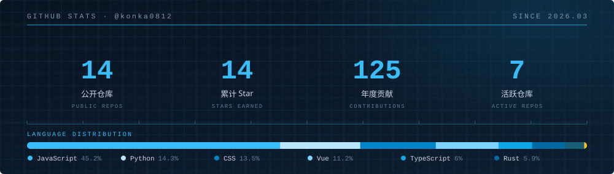

  

 

  

<h2 align="center">关于我 · ABOUT</h2>

写代码的时候，我最在意的只有一件事：**它到底能不能跑起来。**

从 AI Agent 的工具链，到能装进手机的 PWA；从把服务端推到公网，到在浏览器里渲染一个 3D 场景 —— 大部分时间我都花在同一件事上：把想法变成能用的东西。

|  |  |
| :--- | :--- |
| **现在** | 构建 AI Agent 与开发者工具链 |
| **偏爱** | PWA · 创意前端 · 3D 网页 · 把部署这件事讲清楚 |
| **坐标** | 郑州 · 中国 `34.75°N 113.63°E` |
| **信条** | 先让它跑起来，再让它好看 |

  

<h2 align="center">技术栈 · STACK</h2>

**语言 · LANGUAGES**

**前端 · FRONTEND**

**后端 & 工具 · BACKEND & TOOLS**

**AI · AGENT**

  

<h2 align="center">精选项目 · SELECTED WORK</h2>

| 项目 | 简介 | 技术 |
| :--- | :--- | :--- |
| ★ **[deepseek-harness-deployment-guide](https://github.com/konka0812/deepseek-harness-deployment-guide)** | DeepSeek Harness 部署服务器、开启公网访问限制的完整教程 | `Markdown` |
| ★ **[deepseek-harness-deployment-plug](https://github.com/konka0812/deepseek-harness-deployment-plug)** | 服务器公网暴露插件，并解决公网访问时插件设置打不开的问题 | `Shell` |
| ★ **[nine-grid-storyboard](https://github.com/konka0812/nine-grid-storyboard)** | 生成 3×3 分镜关键帧表与图生视频提示词，覆盖 3–12 秒短片 | `Python` |
| **[lianleme](https://github.com/konka0812/lianleme)** | 练了么 · 302 个标准健身动作的开源 PWA 图鉴 | `Vue` `PWA` |
| **[time-freeze-game](https://github.com/konka0812/time-freeze-game)** | 你不动，时间就停 —— Superhot-like 2D 时间冻结网页游戏 | `JavaScript` |
| **[stock-monitor-pet](https://github.com/konka0812/stock-monitor-pet)** | PawTrader · 常驻桌面的行情宠物，盯 A 股 / 港股 / 美股 / 黄金 | `TypeScript` |

  → <a href="https://github.com/konka0812?tab=repositories">查看全部 12 个仓库</a>

  

<h2 align="center">数据 · STATS</h2>

  

  

<h2 align="center">联系 · CONTACT</h2>

|  |  |
| :--- | :--- |
| **GitHub** | [@konka0812](https://github.com/konka0812) |
| **Issues** | 在任意仓库开 Issue，我都会看到 |
| **时区** | UTC+8 · 郑州 |

 

  

