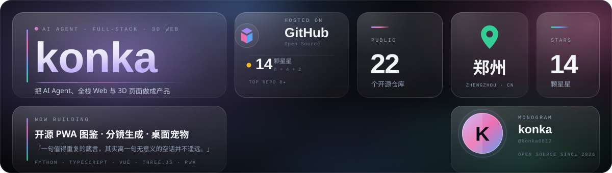
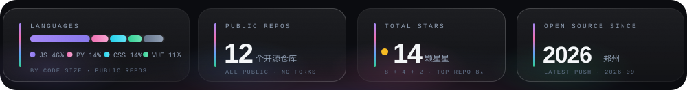

  

**AI Agent 工具链 · 全栈 Web · PWA · Three.js 创意前端**

郑州 · Zhengzhou, China · 把想法做成能跑起来的产品

 

 

## 你好 / HELLO

我做 **AI Agent 工具链**——把模型、插件与真实工作流接在一起，让它不只是会聊天，而是真的能把事做完。
也做 **全栈 Web 与 PWA**：一个链接打开就能用，装到桌面、断网也能跑；还有 **Three.js 创意前端**，用 WebGL 把抽象的东西变成看得见的东西。
主要写 **Python / TypeScript / Vue**，人在 **郑州**，习惯先把东西跑起来，再谈它够不够优雅。

> 「一句值得重复的箴言，其实离一句无意义的空话并不遥远。」
> —— 所以这里少讲愿景，多放能点的链接。

### 现在在做什么

<table>
<tr>
<td width="50%" valign="top">

**🧩 AI Agent 工具链**
把 Harness、插件、Skill 串成一条能落地的链路。

</td>
<td width="50%" valign="top">

**📱 PWA 与小产品**
练了么：302 个健身动作的开源图鉴，离线可用。

</td>
</tr>
<tr>
<td width="50%" valign="top">

**🌐 全栈 Web 交付**
从公网部署教程到前后端一体，讲清楚每一步。

</td>
<td width="50%" valign="top">

**🎮 3D / 创意前端**
Three.js、九宫格分镜、时间停止小游戏。

</td>
</tr>
</table>

 

## 技术栈 / STACK

**语言 / LANGUAGES**

**前端 / FRONTEND**

**Agent 与后端 / AGENT & BACKEND**

**工程与工具 / TOOLING**

 

## 精选项目 / PROJECTS

<table>
<tr>
<td width="50%" valign="top">

**🏋️ [lianleme](https://github.com/konka0812/lianleme)**
练了么 · 302 个标准健身动作的开源 PWA 图鉴

</td>
<td width="50%" valign="top">

**🚀 [deepseek-harness-deployment-guide](https://github.com/konka0812/deepseek-harness-deployment-guide)**
DeepSeek Harness 公网部署教程 · 一步一步讲透

</td>
</tr>
<tr>
<td width="50%" valign="top">

**🔌 [deepseek-harness-deployment-plug](https://github.com/konka0812/deepseek-harness-deployment-plug)**
公网暴露插件 · 把本地 Agent 安全地放上线

</td>
<td width="50%" valign="top">

**🎬 [nine-grid-storyboard](https://github.com/konka0812/nine-grid-storyboard)**
3×3 分镜关键帧图与图生视频提示词生成

</td>
</tr>
<tr>
<td width="50%" valign="top">

**⏳ [time-freeze-game](https://github.com/konka0812/time-freeze-game)**
你不动，时间就停 · Superhot-like 2D 网页游戏

</td>
<td width="50%" valign="top">

**🐾 [stock-monitor-pet](https://github.com/konka0812/stock-monitor-pet)**
PawTrader 桌面宠物行情助手 · 盯盘也有陪伴

</td>
</tr>
</table>

<a href="https://github.com/konka0812?tab=repositories">还有 16 个仓库在架上 →</a>

 

## 数据 / STATS

  

 

## 找我 / SAY HI

<table>
<tr>
<td width="33%" align="center" valign="top">

**🐙 GitHub**

[@konka0812](https://github.com/konka0812)

代码、Issue、Star 都在这里

</td>
<td width="33%" align="center" valign="top">

**✉️ Email**

`konka0812@example.com`

占位地址 · 换成你的真实邮箱

</td>
<td width="33%" align="center" valign="top">

**📍 郑州**

UTC+8 · 随时欢迎聊 Agent

咖啡因驱动的开发时区

</td>
</tr>
</table>

 

如果你也在做 Agent 或者好玩的前端，**随时来聊**。
毕竟——一句值得重复的箴言，也不该只是被重复。

 

BENTO 设计 · 玻璃便当格 · 全部视觉由 <code>./assets/*.svg</code> 手写渲染

