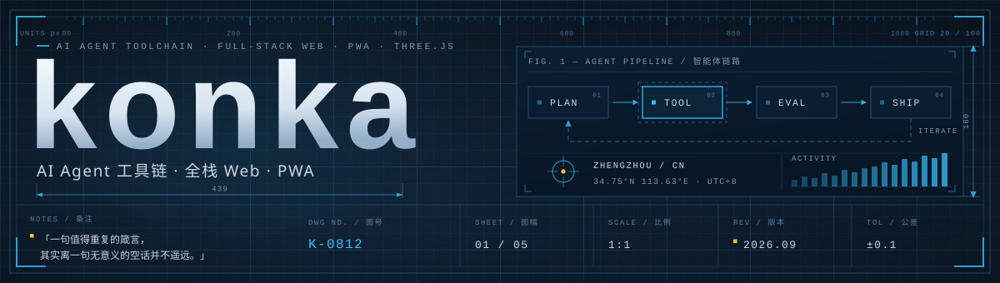
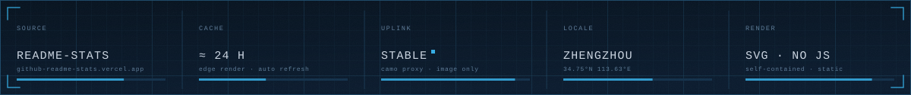
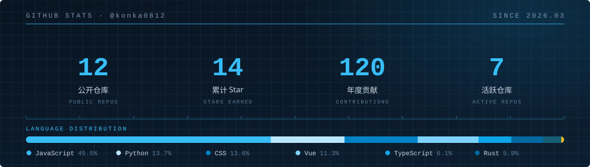
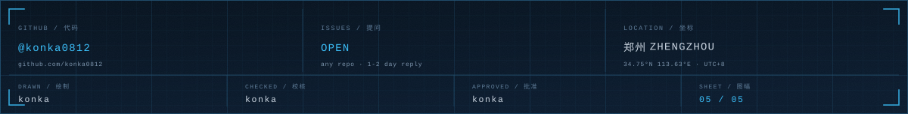

  

## [ 01 ] 关于我 / SPEC

| 字段 / FIELD | 值 / VALUE |
| :--- | :--- |
| 身份 / ROLE | AI Agent 工具链 · 全栈 Web 工程师 |
| 坐标 / LOC | 郑州，中国 · `34.75°N 113.63°E` · <kbd>UTC+8</kbd> |
| 当前方向 / FOCUS | Agent 工具链、PWA、Three.js 创意前端 |
| 常用工具 / TOOLS | TypeScript · Python · Vue · Node.js · Docker |
| 信条 / CREED | 一句值得重复的箴言，其实离一句无意义的空话并不遥远。 |

我做的事情大多从同一个问题开始：**它能不能真的跑起来。** Agent 的工具链要接得上真实服务，Web 应用要能装进口袋离线使用，3D 场景要在普通笔记本上稳在 60 帧。

所以流程很短：写 → 部署 → 观察 → 再改一轮。图纸上的公差写着 ±0.1，代码里的公差靠测试和日志兜住。

## [ 02 ] 技术栈 / STACK

| 分组 / GROUP | 组件 / COMPONENTS |
| :--- | :--- |
| **语言** LANG |     |
| **前端** WEB |      |
| **后端与数据** SERVER &amp; DATA |      |
| **AI 与工具** AI &amp; TOOLING |      |

## [ 03 ] 精选项目 / MODULES

| 编号 | 模块 / MODULE | 说明 / DESCRIPTION | 语言 / LANG |
| :--- | :--- | :--- | :--- |
| K-01 | **[lianleme](https://github.com/konka0812/lianleme)** | 练了么 · 302 个标准健身动作的开源 PWA 图鉴 | Vue |
| K-02 | **[deepseek-harness-deployment-guide](https://github.com/konka0812/deepseek-harness-deployment-guide)** | DeepSeek Harness 公网部署教程（8★） | Markdown |
| K-03 | **[deepseek-harness-deployment-plug](https://github.com/konka0812/deepseek-harness-deployment-plug)** | 公网暴露插件（4★） | Shell |
| K-04 | **[nine-grid-storyboard](https://github.com/konka0812/nine-grid-storyboard)** | 3×3 分镜关键帧图与图生视频提示词（2★） | Python |
| K-05 | **[time-freeze-game](https://github.com/konka0812/time-freeze-game)** | 你不动，时间就停 · Superhot-like 2D 网页游戏 | JavaScript |
| K-06 | **[stock-monitor-pet](https://github.com/konka0812/stock-monitor-pet)** | PawTrader 桌面宠物行情助手 | TypeScript |

编号沿用图纸序号 K-01 … K-06，与图号 K-0812 共用同一套编号体系。

## [ 04 ] 遥测 / TELEMETRY

  

## [ 05 ] 联络 / CONTACT

| 通道 / CHANNEL | 地址 / ADDRESS |
| :--- | :--- |
| GitHub | [@konka0812](https://github.com/konka0812) |
| Issues | 任意仓库开 Issue，比邮件更快 |
| 坐标 / LOC | 郑州 Zhengzhou, CN · `34.75°N 113.63°E` · <kbd>UTC+8</kbd> |
| 响应 / RESPONSE | issue 优先，邮件次之，通常 1–2 天内回复 |

图纸会归档，代码不会。有问题就开 issue —— **能跑起来的东西，比说得漂亮的东西更值得维护。**

  <code>DWG NO. K-0812 · SHEET 05 / 05 · REV 2026.09 · SCALE 1:1 · TOL ±0.1</code>

