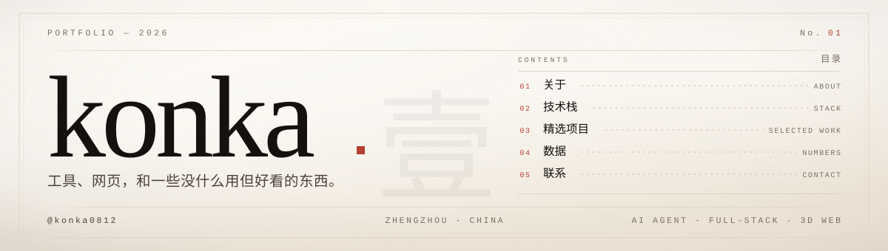
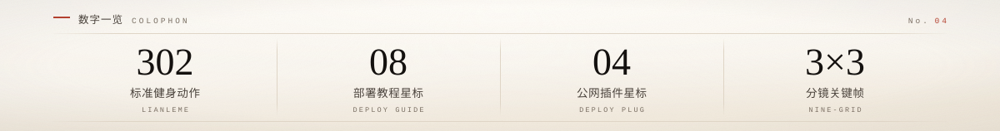

  

 

## 01 &nbsp;·&nbsp; 关于 ABOUT

在郑州写代码，主要做 AI Agent 工具链——把模型、提示词、插件和一堆零散脚本收进同一条流水线，让它们安静地自己跑完。
 
也写全栈 Web 和 PWA：能离线打开、能装进手机桌面那种。偶尔把 Three.js 拉进来，给页面加一点不必要但好看的动效。
 
喜欢边界清楚的东西。一个文件做一件事，一个函数只说一句话。做得不快，但尽量做得能一直用下去。

 

> 一句值得重复的箴言，其实离一句无意义的空话并不遥远。

 

## 02 &nbsp;·&nbsp; 技术栈 STACK

**语言 &nbsp;/&nbsp; LANGUAGES**
 
   

**前端 &nbsp;/&nbsp; FRONTEND**
 
   

**后端与数据 &nbsp;/&nbsp; BACKEND &amp; DATA**
 
   

**AI &nbsp;/&nbsp; AGENT TOOLCHAIN**
 
   

 

## 03 &nbsp;·&nbsp; 精选项目 SELECTED WORK

| &nbsp; | 项目 &nbsp;/&nbsp; REPOSITORY | 一句话 &nbsp;/&nbsp; NOTE |
| :--: | :-- | :-- |
| `01` | **[lianleme](https://github.com/konka0812/lianleme)** | 练了么 · 302 个标准健身动作的开源 PWA 图鉴 |
| `02` | **[deepseek-harness-deployment-guide](https://github.com/konka0812/deepseek-harness-deployment-guide)** | DeepSeek Harness 公网部署教程 · 8★ |
| `03` | **[deepseek-harness-deployment-plug](https://github.com/konka0812/deepseek-harness-deployment-plug)** | 公网暴露插件 · 4★ |
| `04` | **[nine-grid-storyboard](https://github.com/konka0812/nine-grid-storyboard)** | 3×3 分镜关键帧图与图生视频提示词 · 2★ |
| `05` | **[time-freeze-game](https://github.com/konka0812/time-freeze-game)** | 你不动，时间就停 · Superhot-like 2D 网页游戏 |
| `06` | **[stock-monitor-pet](https://github.com/konka0812/stock-monitor-pet)** | PawTrader 桌面宠物行情助手 |

 

## 04 &nbsp;·&nbsp; 数据 NUMBERS

  
  &nbsp;&nbsp;
  

 

  

 

## 05 &nbsp;·&nbsp; 联系 CONTACT

写邮件 &nbsp;·&nbsp; `konka0812@example.com` &nbsp;占位，替换成你自己的
 
在 GitHub 找我 &nbsp;·&nbsp; [@konka0812](https://github.com/konka0812)

 

> 如果这里面有一个东西刚好对你有用，那就够了。

 

  

